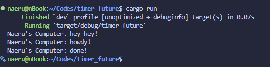

# Module 10 - Asynchronous Programming

# Tutorial 1: Timer

## Reflection 1.2. Understanding how it works.

I modified the code to print `Naeru's Computer: hey hey!` right before the spawner is dropped. This is the terminal output after the modification.

Notice how the `hey hey!` message is printed first, then `howdy!`, and after 2 seconds, `done!`. This is because `spawner.spawn()` that was called first only queues the future into the channel. We actually executed the future when we called `executor.run()`after the spawner is dropped. Until then, the task remains queued. So, the sequence is:

- `spawner.spawn(...)` places the task into the channel.
- `println!("Naeru's Computer: hey hey!")` runs immediately on the main thread.
- `executor.run()` is called next; it pulls the queued task, polls it, and then the task prints `howdy!`.
