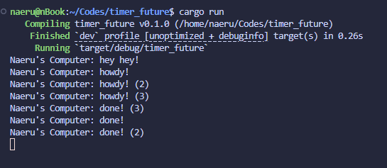
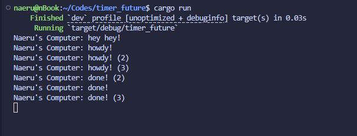
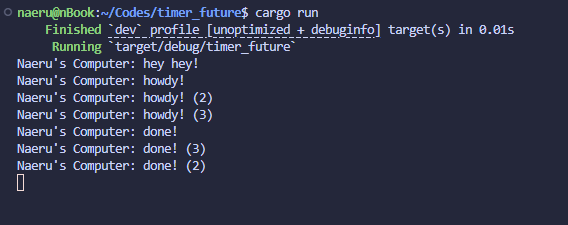

# Module 10 - Asynchronous Programming

# Tutorial 1: Timer

## Reflection 1.2. Understanding how it works.

I modified the code to print `Naeru's Computer: hey hey!` right before the spawner is dropped. This is the terminal output after the modification.

Notice how the `hey hey!` message is printed first, then `howdy!`, and after 2 seconds, `done!`. This is because `spawner.spawn()` that was called first only queues the future into the channel. We actually executed the future when we called `executor.run()`after the spawner is dropped. Until then, the task remains queued. So, the sequence is:

- `spawner.spawn(...)` places the task into the channel.
- `println!("Naeru's Computer: hey hey!")` runs immediately on the main thread.
- `executor.run()` is called next; it pulls the queued task, polls it, and then the task prints `howdy!`.

## Reflection 1.3. Multiple spawn and removing drop.

There are now three spawn calls, each queuing a task into the channel. I ran 3 parallel tasks, and the output is as follows:

Notice that in all tasks, they all print `hey hey!` first, then we enter the first spawner output (`howdy!`), then second spawner output (`howdy! (2)`), and finally the third spawner output (`howdy! (3)`). Then after 2 seconds, all tasks print `done!`, but the order of `done!`, `done! (2)`, and `done! (3)` is not guaranteed. This is because each done is printed when that task's `TimerFuture` completes and calls the task's waker (`wake_by_ref`) which enqueues the task for the executor. The exact order those wakes happen depends on timer expirations and thread scheduling (OS scheduling, timer thread timing, race between wake calls), so the queueing order is nondeterministic when multiple timers expire at nearly the same time. And notice how the tasks never actually exit (always running) until we hit `Ctrl-C`. This is because the spawner is never dropped, so the executor keeps waiting for new tasks to be spawned.
